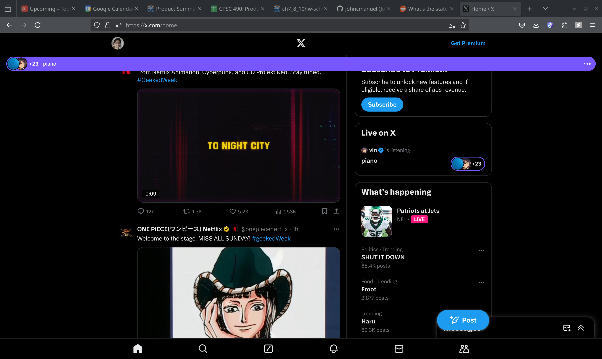
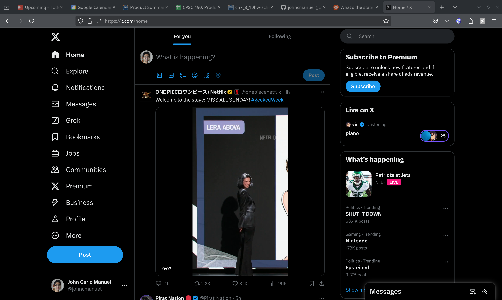
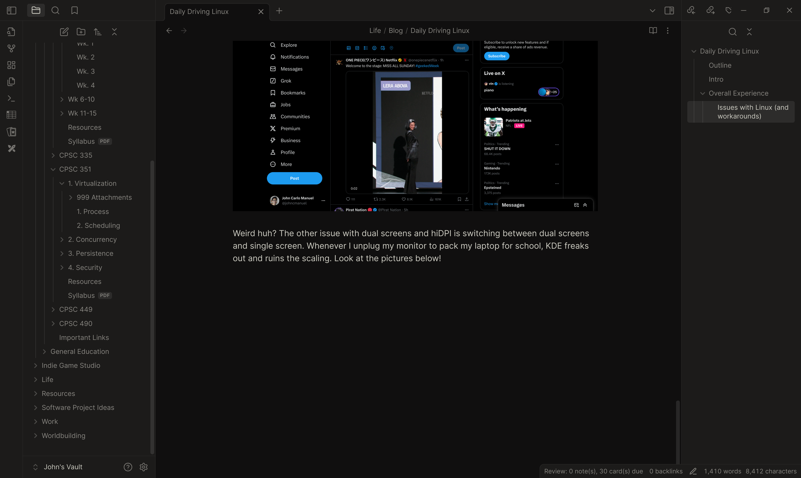
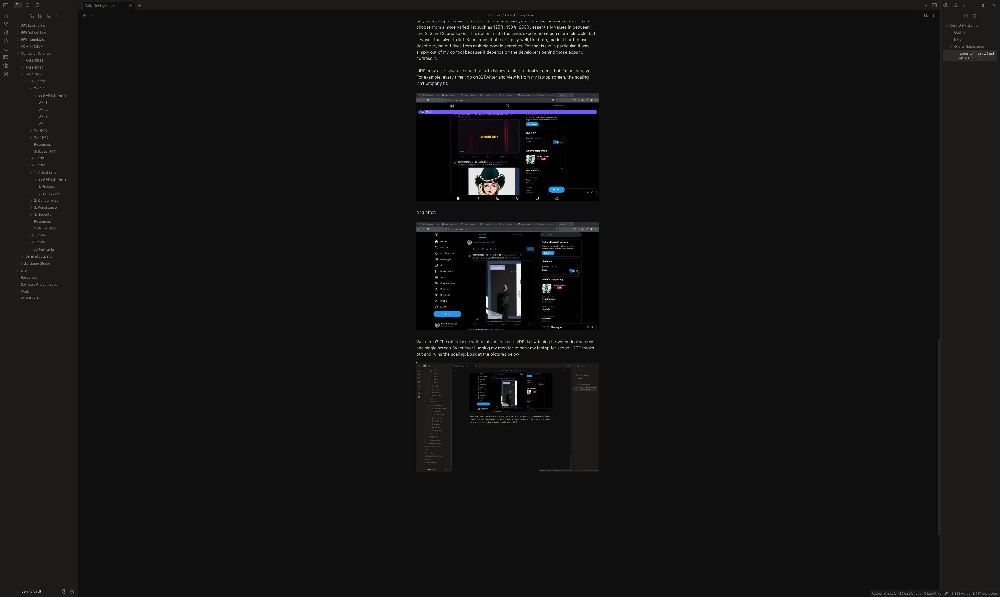

## Intro

I first started out my computer journey at around four years old, when I wanted to play those browser games that Disney launched on their website. I was on my parents' Windows XP computer, and didn't really know much about computers outside of games. I only knew it as a black box that lets me play games.

For a very long time, I was a Windows user. Everything I've done on the computer before was on Windows: video games, school, programming, late night Discord calls with the homies, and a lot more.

While becoming more experienced with software engineering, I started to become a bit frustrated with the general workflow on Windows. For context, I mainly do web development and sometimes game development. Even though compatibility amongst operating systems is great for web development and maybe game development, setting up development environments was the biggest flaw. To ensure compatibility between each developer, Windows users would typically use WSL. This is fine since it gets the job done quickly; however, it can be pretty slow sometimes.

On one of my web dev projects, I use devbox, a conveninent, developer tool powered by Nix that instantiates all of the essential tools with the correct versions without having to download them manually. This helps me create a reproducible developer environment without managing multiple, different versions of the same software to run across multiple projects. This has been significantly helpful, now that I don't have manage 10 different Python versions on my computer.

When using devbox on WSL, it was pretty slow. The web dev project I mentioned is a Next.js project. After setting up the project in WSL, I ran the dev version of the project, and, wow. It took 30 seconds to launch the site. And note that I haven't started on the project yet; it was a simple Hello World site that came with create-next-app.

Rather than committing to using devbox and WSL, I went the standard way of installing packages: run npm that came with a globally installed Node.js and go on with my day. Though, it felt weird not using Nix to manage my packages for my projects, and it bothered me. I personally didn't like having global packages installed for only a single project.

Sometime after that, Mutahar aka SomeOrdinaryGamers released a video about switching to Linux, where he went over a basic installation of Linux Mint. I always thought installing Linux (in general) was pretty complicated but it was dead simple. At least in my experience.

So, during the summer I went ahead and started testing a live environment of Linux Mint Cinnamon. What I first noticed out of the box was some of the function keys not working, mainly the brightness keys. Second, the audio on my laptop's speakers were lacking the bass speakers; it sounded very tinny. There were more little problems I don't remember, but everything else worked well.

If I wanted to have better support out of the box for my laptop, I needed to switch to a more recent kernel. After trying out Linux Mint Edge (basically Linux Mint with a more recent kernel, but not very very recent), it solved the little problems I had but broke some major components such as WiFi, bluetooth, etc. I didn't want to waste more time trying to debug it; I needed something to work without much hassle.

> For those curious, here are my current laptop's specs (as of 9-19-24)
>
> - Processors: 16 × 12th Gen Intel® Core™ i7-1260P
> - Memory: 15.3 GiB of RAM
> - Graphics Processor: Mesa Intel® Graphics
> - Manufacturer: LENOVO
> - Product Name: 82LU
> - System Version: Yoga 9 14IAP7

A resource on GitHub actually patched these fixes on the most recent kernels. So of course, I'll need distros that come with those recent kernel versions.

I heard about rolling release distros like Arch, but I didn't want to commit to something that constantly changes, which may break things that I may not know how to fix, especially in a computer with newer hardware. But at the same time I needed a distro that works well with a pretty recent kernel. I needed a distro with recent kernels while maintaining stability.

That's when I learned about Fedora, a semi-rolling release distro, which is what I needed. After a few test runs and veriifying that my workflow is compatible enough, I wiped out Windows and installed Fedora. I could have just dual-booted instead, but it can be a bit tricky to setup and maintain. Plus, I wanted to step out of my comfort zone and work in an environment I'm not accustomed to for daily usage.

> My Fedora specs if you're interested (as of 9-19-14)
>
> - Operating System: Fedora Linux 40
> - KDE Plasma Version: 6.1.3
> - KDE Frameworks Version: 6.4.0
> - Qt Version: 6.7.2
> - Kernel Version: 6.9.11-200.fc40.x86_64 (64-bit)
> - Graphics Platform: Wayland

## The Experience

### The Good

As of writing this, it's been about three months since I made the switch. And honestly, despite some of the bugs and workarounds I had to make, I'm very content with my workflow on Linux.

My workflow on my laptop usually consists of:

1. Admin tasks: working with pdfs, emails, writing, planning, etc.
2. Software engineering: coding, design docs, interview prep, dev environments, etc.
3. Academics: notetaking, telecomms, etc.

So what are the good things? There's too many to count, honestly. Free and open source, privacy, Unix shell commands, lightweight in size, which leads to faster boot time and system responsiveness, highly customizable (especially KDE), better dev experience as a software engineer, and a lot more reasons. The Linux experience is just too good.

### The Bad and the Ugly (with workarounds)

But the experience isn't all sunshines and rainbows, though. There were a handful of issues that were solved easily, but there are a couple, ongoing ones that really bother me.

The first one being Discord's native app. My biggest issue is, you guessed it, screensharing. Basically, most of today's distros are moving to Wayland from X11. They're basically protocols that enables applications to render graphics on the display (google it for a better and probably more correct answer). Plus, audio doesn't work too. Everything else seems to work fine. The only solutions to this is to use the browser version or a custom third-party client with Wayland and audio support out of the box. I wouldn't recommend the second option since it does break TOS. Ultimately, Discord mainly caters to the Windows and Mac users since they definitely make up most of the user base, so I honestly don't expect much support for Linux users unless they shift priorities in their development. Let's hope they do in the future!

The other issue is hiDPI. It was a pain in the ass to solve before, but it's a lot more tolerable now. While trying out different desktop environments (KDE v. GNOME), I concluded that KDE had better support for hiDPI because of fractional scaling. This option allowed me to find the sweet spot where the UI isn't too big or too small. Without fractional scaling I could only choose options like 100% scaling, 200% scaling, etc. However with it enabled, I can choose from a more varied list such as 125%, 150%, 250%, essentially values in between 1 and 2, 2 and 3, and so on. This option made the Linux experience much more tolerable, but it wasn't the silver bullet. Some apps that didn't play well, like Krita, made it hard to use, despite trying out fixes from multiple google searches. For that issue in particular, it was simply out of my control because it depends on the developers behind those apps to address it.

hiDPI may also have a connection with issues related to dual screens, but I'm not sure yet. For example, every time I go on X/Twitter and view it from my laptop screen, the scaling isn't properly fit.

And after:

Weird huh? The other issue with dual screens and hiDPI is switching between dual screens and single screen. Whenever I unplug my monitor to pack my laptop for school or need to bring it around the house, KDE freaks out, some crashes occur with the plasmashell, and ruins the scaling on most apps. Look at the pictures below!

It's very annoying, and I never had that problem before on Windows. I haven't looked into the issue yet due to other responsibilities, but I hope there are fixes out there.

Luckily the workaround is simple: just restart the app and the scaling is fixed. But having to do that when using a multi-monitor setup with your laptop that you bring around with you everywhere sucks.

## Final Thoughts

Operating systems are like cars we use extensively to get us to our destination. Windows and Mac are like luxury or high-end cars: they provide most of the features that ensure we have a smooth driving experience. Linux, on the other hand, is like a budget car. It doesn't have all of the better new/existing features that the high end cars have, but it is still a form of transportation that gets us to where we want to go, and it can customizable to the point that it could likely outmatch the high-end cars. In the end, they are all tools for us to get things done. For me, Linux is just that one tool that helps me get things done quicker.

(honestly don't know if that analogy makes sense)

TL;DR: Linux is great and has its flaws for my workflow but it is a tool that helps me get the job done.

## Resources I've used for Linux

Check them out if we share the same laptop!

1. [my laptop model on arch linux wiki](<https://wiki.archlinux.org/title/Lenovo_Yoga_9i_2022_(14AiPI7)>)
2. [Philipp Jungkamp's patches repo for my laptop model](https://github.com/PJungkamp/yoga9-linux)
3. [HiDPI page on arch linux wiki](https://wiki.archlinux.org/title/HiDPI)
