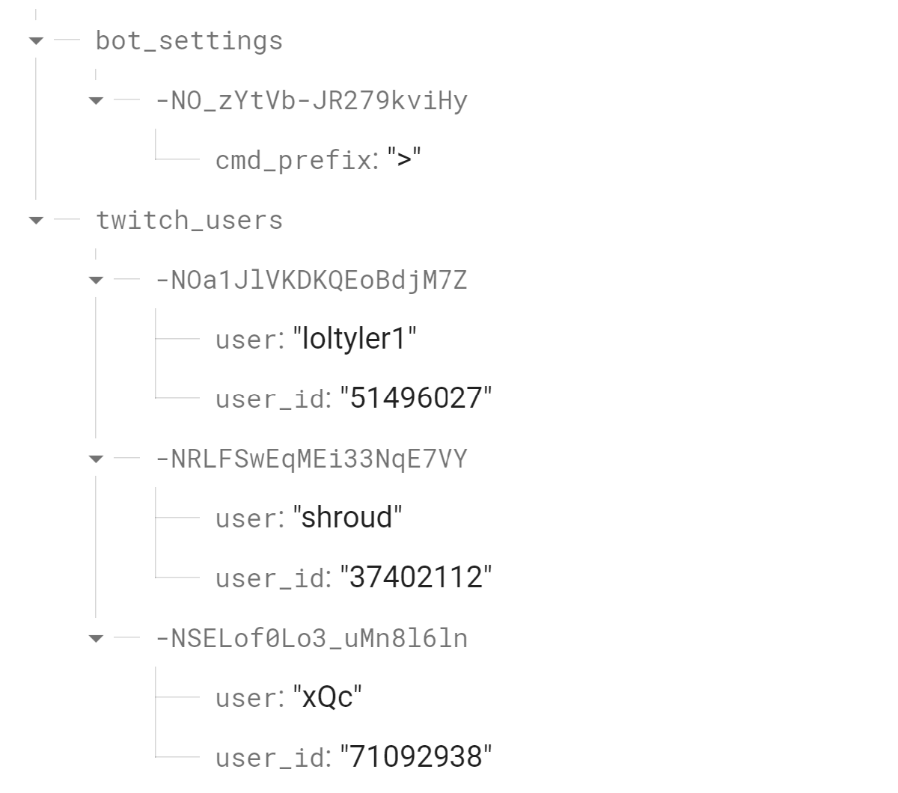
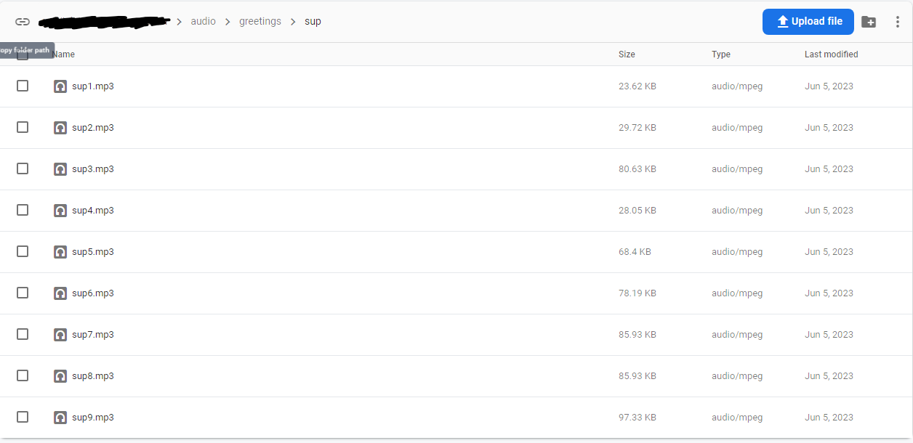
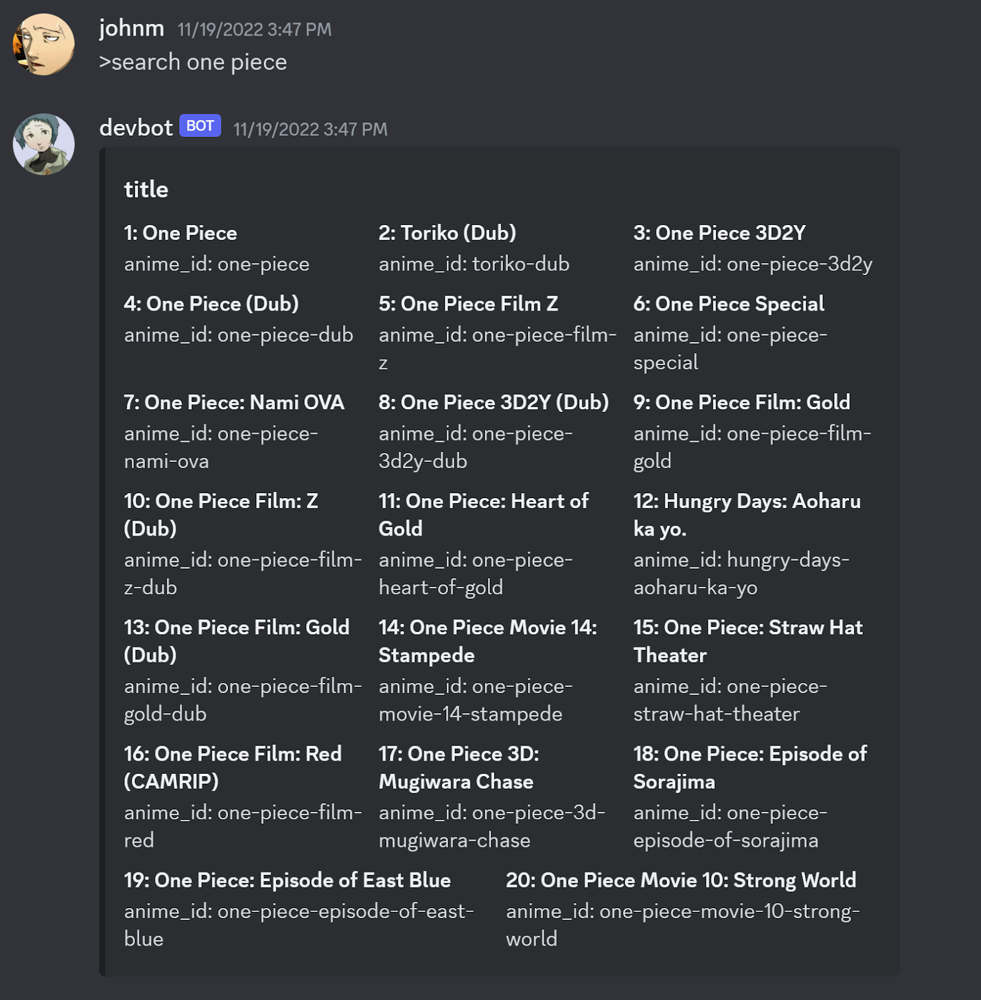
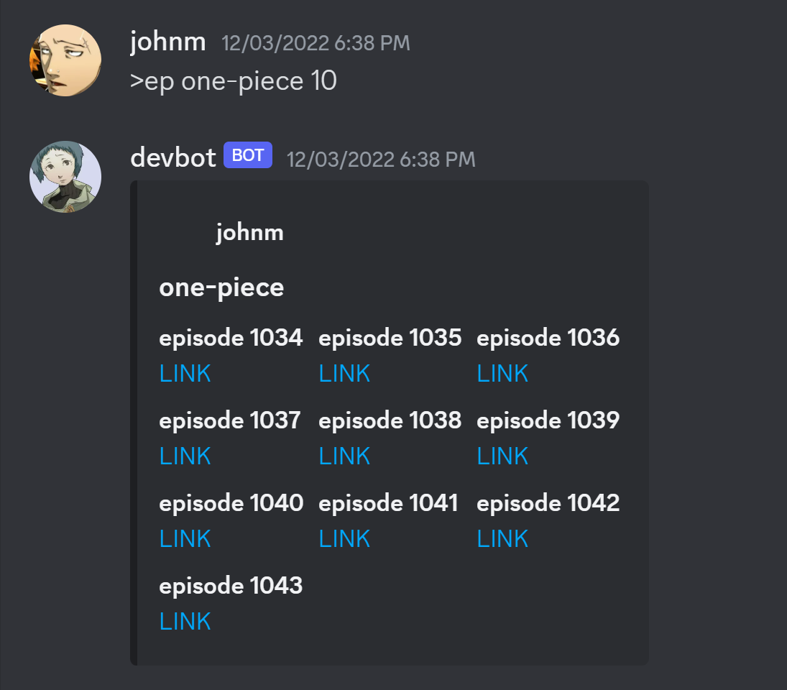
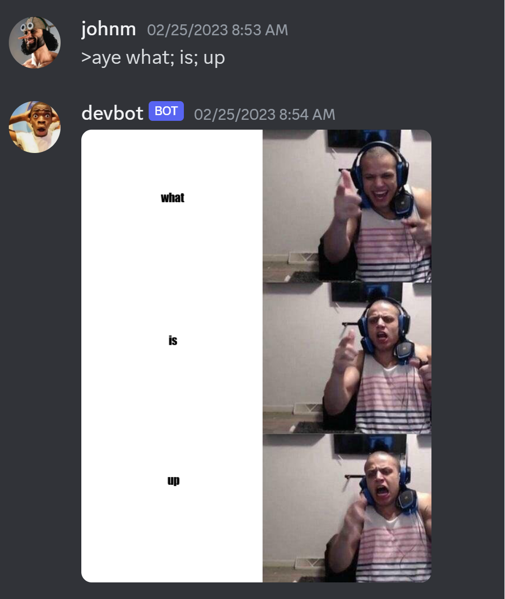
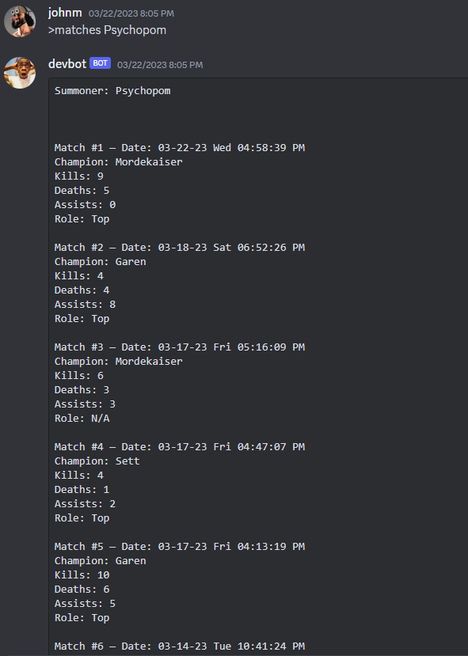
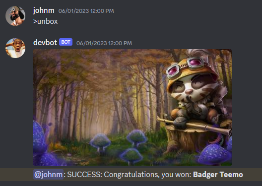

Sometime in early 2021 after most, if not all of the world shut down because of COVID, I spent a hefty of my time during quarantine playing video games with my friends. The main platform we use to chat and send the funniest memes is Discord.

Since I was stuck at home taking online classes (super easy, gen-ed classes at the time), I had way too much time on my hands. I knew I wanted to do something productive instead of sitting around doing nothing but playing video games all day, so I thought to myself: hey, why not make a Discord bot for my friends’ server? Why not make a Discord bot with a ton of funny commands? Wouldn’t that be cool?

So I started doing some research into making Discord bots. I typed into Google: “How to get started with Discord bots”. I first stumbled across [discord.py](https://discordpy.readthedocs.io/en/stable/), which was a very decent API Python wrapper around [Discord’s API](https://discord.com/developers/docs/reference). I started playing around with it and made some funny commands. The classic, funniest command is a command that pings (or notifies) a user for a certain amount of time. Or, without sugarcoating it, it spams them. I would type the command, input the first argument (the user) and the second argument (the number of times to ping the user), and then hit enter!

I programmed the command to have a default of 15 times in case the second argument is not given. This would spam the user 15 times, which was hilarious when doing it with my friends!

Sometime later, I started planning out the rest of the features that I wanted to add to the bot. Here are some example features that were implemented:

1. Automated notifications system that notifies us whenever our favorite Twitch streamers go live
2. Anime episodes searcher
3. Meme generator
4. And more features (feature creep alert!)

After giving it some thought, I want to be able to build a scalable, open-source, batteries-included Discord bot that developers and server owners can utilize for their servers.

The project has gotten more complex since its start, and on top of school, job searching, and other responsibilities, finding time to work on this is difficult. While this project was fun to work on, it was a great learning experience for applying good software engineering principles and software design.

I’ll go ahead and write an entire section dedicated to the technicalities from a high-level perspective of the bot if you’re interested. Also, note that the writing below will be more formal. What I hope for you to take away from the technical details is learning from my solutions and the reasoning behind them and coming up with other, probably even better ways to improve them, to build an effective Discord bot.

---

## The Technical Details

### Cloud Databases

Two cloud databases will be used: one for storing textual and numerical data, and another for storing external media. The bot supports only Google Firebase services at the moment. In the near future, I will create options for developers and server owners to utilize other cloud providers such as [Amazon Web Services](https://aws.amazon.com/) or [Microsoft Azure](https://azure.microsoft.com/en-us).

#### Google Realtime Database (GRTDB)

For the bot to store persistent data such as command prefixes and a list of Twitch streamers, I chose Google’s Realtime Database because it is easy to spin up a NoSQL database and start prototyping quickly. It is even better since [Google developed their API wrapper](https://firebase.google.com/docs/reference/admin/python) for interfacing with the database in Python.

Below is an example of the data the bot stores for each of its entries.

A class wrapper is written to abstract its complexities. Therefore, the developer can only refer to the [CRUD operation](https://en.wikipedia.org/wiki/Create,_read,_update_and_delete) functions to interact with the database. You may notice that in each entry, there is an associated, unique key. The database implemented this feature to ensure that there are no write conflicts when multiple calls are made to write to a particular section of data ([see more here](https://firebase.google.com/docs/database/admin/save-data#section-push)). I find this convenient for my bot because I want to handle writing conflicts when multiple users simultaneously invoke commands

to write data to the database. [You may read more about GRTDB if you wish](https://firebase.google.com/docs/database).

I chose to use this database over Google Firestore since the current amount of traffic for the bot is low and does not require any advanced querying. However, if server owners using this bot experience high amounts of traffic in their servers, they should modify the repository to utilize Firestore. In the near future, I may create an option to choose between Firestore or GRTDB.

#### Google Cloud Storage (GCS)

Another database used to store external media is called Google Cloud Storage. This will primarily be used to store audio files for the Audio File Player feature and (in the future) template memes for the Meme Generator feature. As with GRTDB, a class wrapper is written to abstract its complexities. Users can perform CRUD operations, similar to GRTDB. [You may read more about GCS if you wish](https://firebase.google.com/docs/storage).

### Features

#### Automated Twitch Notifications System

The purpose of this feature is to notify server members about any user-selected Twitch streamers that go live on Twitch.

The system utilizes [pyTwitchAPI](https://github.com/Teekeks/pyTwitchAPI) and the bot’s database. pyTwitchAPI handles most of the processing and authentication. In [Twitch’s API](https://dev.twitch.tv/docs/api/), each user has a collection of data, such as name, user ID, and lots of other useful information. Data about a particular streamer is found by passing in the correct username of the streamer and making calls to the API. After the API returns the user data, the data is traversed to see if the user is live on Twitch. If they are, send the notification message and repeat this process for the next user.

For every 1.5 minutes, the system makes calls to Twitch’s API using the list of Twitch users found in the database and sends notifications to a designated Discord text channel for each streamer that is currently online.

In [Twitch’s API](https://dev.twitch.tv/docs/api/), each user has a collection of data, such as name, user ID, and lots of other useful information. Data about a particular streamer is found by passing in the correct username of the streamer and making calls to the API. After the API returns the user data, the data is traversed to see if the user is live on Twitch. If they are, send the notification message and repeat this process for the next user.

While this solution is decent, this does not scale effectively. The reason is that [a variable storing a channel’s chat history](https://github.com/johncmanuel/discordbot/blob/main/src/cogs/twitch.py#L121) has a certain limit for the number of messages it can retrieve. Therefore, if there are more than n amount of notifications being sent to the channel, where n is the limit for how many messages it can store at once, then there will not be enough notification messages to send.

A better solution would be to create a web server that runs concurrently with the bot and listen for changes to any of the specified streamers’ channel statuses through Twitch’s API. If either of them goes live, the web server will receive a response indicating their new status change and forward this to the bot through some means. Webhooks may work, but I would need to do more research on that. Overall, this solution will work for any amount of streamers needed to track.

#### Anime Episodes Searcher

This feature used to work like charm, but not anymore—[AnimixPlay was taken down](https://animixplay.to/). Since the feature is 100 percent dependent on this website, the feature is broken. Prior to its breaking, there were a couple of commands that this searcher was known for: one that searched for a list of animes based on the keyword search the user gave, and another that fetched the amount of recent episodes for a particular anime.

The search command made use of the current bot's session to make POST requests to AnimixPlay's search API with the user-given name of an anime. After processing the HTML results—stored in a JSON response—it extracted the essential data from the HTML. Next, it compiled a list of all search-related names alongside a string ID, which was used to fetch episodes.

The fetch command, with an anime string ID as input and the number of recent episodes to be listed, performed a GET request to AnimixPlay and processed the same data as mentioned earlier, but traversed it for different data: anime episodes and their links. Using the number of recent episodes, it compiled a list of the most recent episodes for that anime and their respective links (see below for an example).

In this case, the bot would fetch One Piece’s 10 most recent anime episodes. This feature would’ve helped my friends and me with watching the latest episodes without taking up additional time searching for them; however, once again this entire feature does not work.

One possible way to fix the feature would be to create an entire web scraper system that collects the latest anime episodes and stores data (i.e. links, dates, anime names, etc.) in a relational database. Though, this requires multiple sources of data to fetch such as other websites for watching anime. This also requires putting more time into creating and maintaining a web scraper that may fail often due to the changing nature of websites’ HTML and CSS elements; thus, the investment may not be worth it at all. The other solution would be to investigate third-party APIs that already accomplished this and fetch the needed data; however, this relies on these APIs being regularly updated.

#### Meme Generator

The meme generator makes use of image processing to achieve a user-generated meme. After the user types the command along with a few parameters, which are the captions for the meme, the bot will utilize a [third-party library](https://github.com/johncmanuel/discordbot/blob/main/src/utils/imageUtils.py) to apply the captions to the meme in their appropriate locations. This library helps with placing the captions in textboxes and wrapping them as needed without it going out of the image. Note that the operations are done in memory; the only persistent data are the template memes (memes without captions). This will later change, which I will explain soon.

After the text has been applied to the image, it is converted into bytes and later converted into a file Discord can recognize. Then, the bot can send the meme to the user with the captions the latter has provided.

Because the template memes are stored in the filesystem of the server they are hosted on, they will stay there until they are removed from the repository. Anyone who adds the bot to other servers will be able to use the same memes. What if the users want to make different memes? What if other servers want to make different memes? Basically, how could we store different memes for different servers?

The solution is to store the meme images in GCS and their respective textbox coordinates in GRTDB. Both data entries will be marked with the same unique key to ensure that one belongs to another. This assumes both databases have a folder for a specific server (which will be worked on in the future). CRUD operations can be used by members with server admin privileges on the meme collections for their server. Rather than storing the memes in the filesystem which would increase the size of the repository, it makes more sense to offload them to the cloud where they can easily be modified accordingly by the users.

Another problem that may occur would be setting up the commands for interfacing with the meme generator. In the picture above, I have used “>aye what; is; up” to generate a meme that requires three captions. This command is hardcoded into the bot, but if the data for template memes becomes dynamic, then what would be the solution to setting up the appropriate commands for the memes?

One solution would be to use a one-command-for-all command, meaning that one command, with a set of parameters, would be used to generate memes. For example, invoking the command: “!meme aye this;is;cool” would generate a similar meme to the picture above. The second parameter can be used to look up a list of filenames matching “aye” in GCS. If one is found, the image will be fetched from GCS, processed in memory, and sent to the user. This requires the user to get all names of the memes in the database and request a picture to be sent to them for reference, so they would be able to provide valid input for the second parameter. However, one downside with this is typing the command; it can be tedious to generate a decent meme in one command.

#### Audio File Player

This one is straightforward: it allows the user to play an audio clip found in GCS.

Users will need to get a list of the names of audio files using a command and be in a voice channel before playing an audio file. Then, the user can use a command to play the audio file they want by providing the name of the audio file. The bot will query the database for the audio file, temporarily store it in the filesystem, join the voice channel the user is in, and play the file. The file is deleted from the filesystem after the bot is done playing it.

This feature can serve as an alternative to Discord’s soundboard feature. The main benefit of using this feature is that the number of audio files that can be played in the Discord server is limited by GCS’s limit rather than Discord’s fixed number of possible sounds that can be stored in a server’s soundboard. [Discord’s maximum possible of sound clips it can fit in a server is 48, assuming the server is boosted at tier 3](https://support.discord.com/hc/en-us/articles/12612888127767#docs-internal-guid-98910e3a-7fff-d156-b753-835d493e7571). [The storage limit for the free tier is 5 GB](https://firebase.google.com/pricing). Assuming the average short sound file is about 300 KB, it can fit 17,476 short audio files.

While the solution for this feature is good enough for a small amount of traffic, it would not scale well once it gradually increases. For example, if about 300 users across 300 distinct servers decided to play sound files from this bot, this would result in 300 concurrent writes to the filesystem, which can have a significant performance hit on smaller cloud servers. This would not be a problem if the server’s hardware is better, but this is still an important issue to address. This will require another solution that involves playing audio from memory rather than disk. As of writing this, I am still researching ways to do this. A start would be to look into existing music player bots that play audio from external websites such as YouTube or SoundCloud.

#### League of Legends Features

Two features utilize Riot Games’ API: player stats lookup and unboxing simulator.

##### Player Matches Lookup

This feature involves consuming data from Riot’s LoL endpoints on a user-given name of a LoL player. Then, the user would be able to query the 10 most recent matches in the following categories: Normal Draft, Normal Blind, Ranked Solo, and Ranked Flex. For each match, the bot will gather the kills, deaths, and assists (KDA) that the player accumulated. The bot will also gather the role/lane, champion played, and date played.

This only accounts for players in the North American (NA) region. Thus, this requires modifying the command parameters to consider different regions. For instance, the user can search for a player followed by the region name to query data from that region. Therefore, users are not only limited to NA players.

##### Unboxing Simulator

This simulator allows users to “unbox” or randomly fetch a skin for a LoL character. Riot Games stores LoL assets and game data in [Data Dragon](https://developer.riotgames.com/docs/lol#data-dragon). The bot queries two Data Dragon URLs: [one for randomly choosing a champion](https://ddragon.leagueoflegends.com/cdn/13.19.1/data/en_US/champion.json) by retrieving a name key under “data”, and another one for randomly choosing a skin by retrieving a “num” value under “skins” ([see one of the files for Aatrox, a champion](https://ddragon.leagueoflegends.com/cdn/13.19.1/data/en_US/champion/Aatrox.json)). The bot will post an image to the user using the URL for Data Dragon’s CDN and the name and “num” for storing the champions’ skins ([see the URL as an example for the champion, Teemo](https://ddragon.leagueoflegends.com/cdn/img/champion/splash/Teemo_3.jpg)).

To further parallel LoL’s loot box experience, chances for unboxing a skin should be calculated based on its rarity. For example, [the odds of unboxing an ultimate skin (the rarest type) is about 0.05%](https://en.number13.de/league-of-legends-actual-drop-chance-ultimate-skin/). The game would become more unpredictable, making this more interesting to unbox skins. Another way to make unboxing more similar is to factor in additional items, such as ward skins or emotes. Moreover, the ability to store the items unboxed by the user in the database would allow the user to see the items they have unboxed.

#### Administrative & Misc. Commands

To help admins manage the server, the bot provides a kit of useful, basic commands such as changing the bot’s avatar, having the bot send DM’s to server members, and changing the command prefix for invoking commands (although this will no longer be used once the bot transitions to using slash commands). There is also a section for fun commands such as rolling the dice.

## Conclusion

The technical details above describe the architecture of the bot and the implemented features. This bot serves as a helper to any Discord server owners or anyone else who wishes to improve their server experience.
