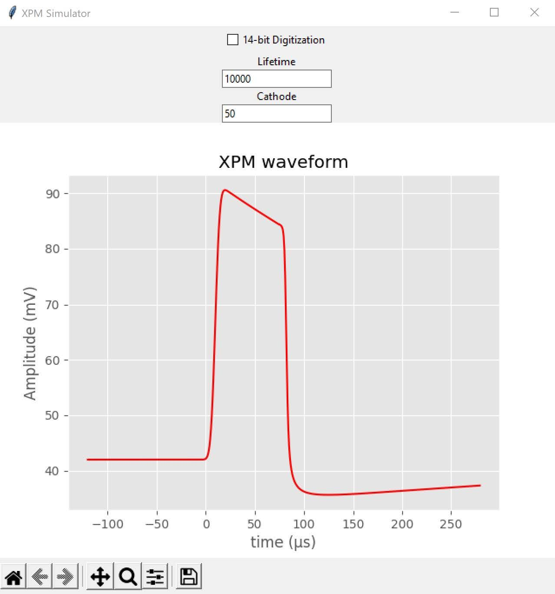
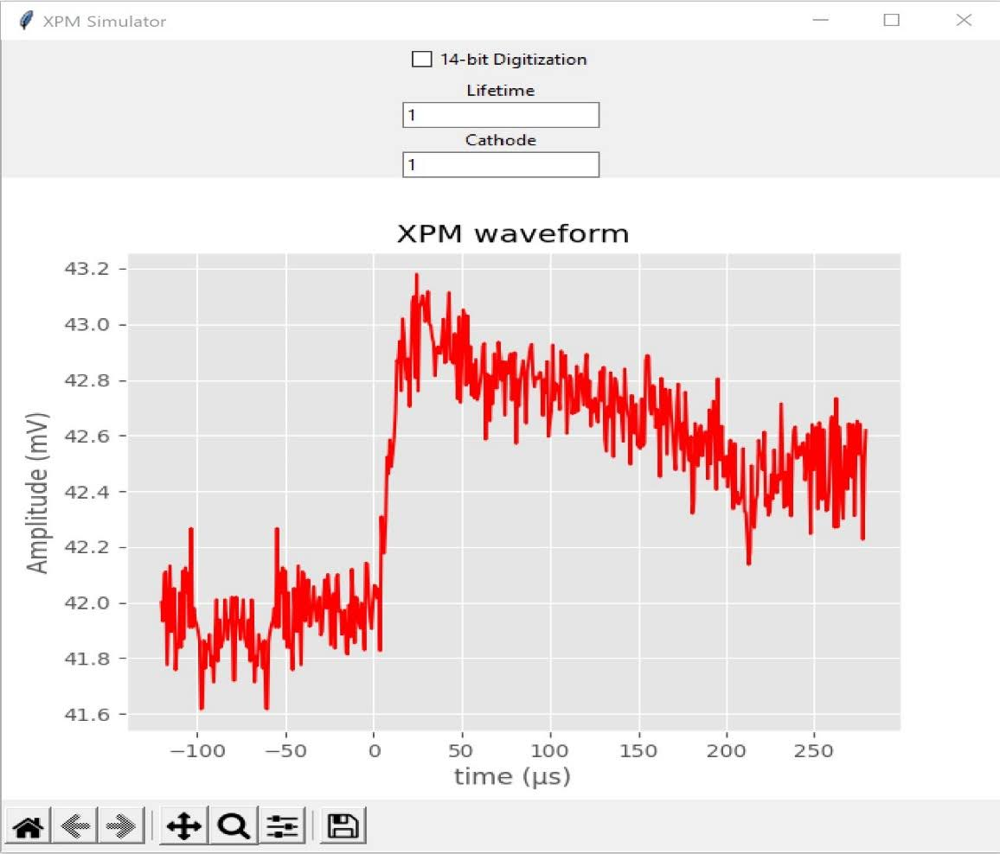

I knew after my Fall semester last year, I had to step up in my academic performance. Even though I petitioned for an excused withdrawal grade for my chemistry class (due to extenuating circumstances via the pandemic and quarantine), which brought up my GPA (while losing credits and therefore money), it still served as a reminder to myself that I need to take college quite a bit more seriously. Adding onto that, I haven’t done any extracurriculars whatsoever! I knew I had to do something to up my academic performance!

The first thing I did? I decided to take on an honors project for my electricity and magnetism course. I reached out to my professor, [Kolo Wamba](https://www.linkedin.com/in/kolowamba/), about a couple of topics relevant to the course material that I wanted to research: semiconductors and wireless communications. While discussing these topics on Zoom, Kolo mentioned a project he wanted assistance with in nEXO, an international effort to discover the neutrinoless beta decay, a rare type of double beta decay consisting of only two electrons and no antineutrinos. nEXO will make use of xenon-136, an isotope of xenon and one of the elements that could experience neutrinoless double-beta decay. [You can read more about nEXO here.](https://nexo.llnl.gov/nexo-overview)

The project I worked on this semester is a simulator of the Xenon Purity Monitor— a special type of hardware that keeps track of the electrons within xenon during an experiment. The simulator aims to help Kolo with understanding the systematic errors that occurred during the experiment. You can read more about it here through this poster I’ve created down below (though I, sadly, haven’t had the chance to present it due to personal and academic responsibilities).

I’m glad I got to work on a project like this. It’s been a while since I’ve programmed an actual working product that can be scaled for future, long-term usage. I definitely brushed up a ton on my Python skills! This was my first time trying out desktop GUI programming. It was okay working with [tkinter](https://docs.python.org/3/library/tk.html), but it can be difficult styling them. Nevertheless, I plan to work on this simulator more with Kolo over the summer and hopefully add more value to it.
